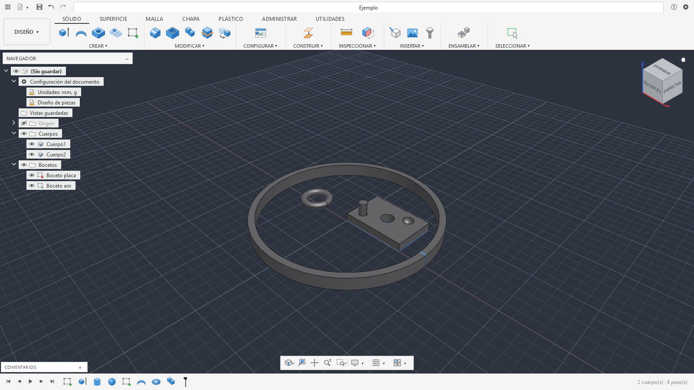

# OmniCAD

**Free and open parametric 3D CAD, written in Python.** You design with a history of steps (timeline) that recomputes
itself when you change a dimension, like professional CAD tools. And **AI agents** (Claude Code, OpenCode, Cursor,
Codex…) can drive it through MCP or the command line.

<div align="center">

## ☕ If OmniCAD helps you, support it

**OmniCAD is free and open.** It is built by one person, in their spare time.<br>
If it is useful to you, a donation helps keep it going.

<a href="https://ko-fi.com/jerryblackve"></a>

</div>

[Versión en español](README.md) · License [GPL-3.0](LICENSE) · Status: **alpha** (tested on Windows and on Ubuntu 24.04 under WSL2)



> The program and most of the documentation are in **Spanish** today. Full English support (UI, messages, tools and
> docs) is on the roadmap. Contributions in English are welcome.

## Features

- **Parametric design:** parameters with units and expressions (`ancho / 2 + 3 mm`), editable timeline, undo/redo.
- **Constrained 2D sketches:** lines, arcs, circles, polygons, splines, dimensions and a constraint solver.
- **Solids:** extrude, revolve, sweep, loft, primitives, fillet, chamfer, shell, draft, holes, threads, ribs, patterns,
  mirror, booleans, split, scale, move and more.
- **Surfaces, sheet metal and meshes:** patch, trim, stitch, thicken; flanges, bends and flat pattern; repair, remesh,
  reduce and smooth meshes.
- **Basic assemblies:** components, joints, rigid groups and fasteners.
- **Files:** open `.omnicad` project format (ZIP with a JSON recipe); exports STL, OBJ, 3MF, PLY, STEP, IGES and BREP;
  imports STEP; sketches from DXF and SVG.
- **Inspection:** volume, mass, area, bounding box, distances, angles and interference.
- **Interface:** 5 themes (modern dark, modern light, professional blue, minimalist and classic) plus user themes
  in a JSON file; toolbox on the S key (search and pin commands).
- **Geometry kernel:** [OpenCascade](https://dev.opencascade.org/) (B-rep).

## For AI agents

OmniCAD ships an **MCP server** and a **CLI** (`omnicad`) generated from a single tool catalog, so both always match.
An agent can create parts, measure them, look at a rendered image and export them; it can also work **live** on the
open window.

```
omnicad setup --cliente todos            # shows what it would configure in Claude Code and OpenCode
omnicad setup --cliente todos --aplicar  # does it (backing up each file as .bak)
```

Tool names and parameters are in English (`create_box`, `fillet`, `radius`); descriptions and messages are in Spanish
for now. Docs: [docs/agentes/](docs/agentes/README.md).

## Download (no coding needed)

Get the installer from the [latest release](https://github.com/JerryblackVe/OmniCAD/releases/latest):

| System | File | How |
|---|---|---|
| Windows 10/11 | `OmniCAD-…-windows-instalador.exe` | Run it and follow the steps. No admin needed. |
| Linux (Ubuntu 22.04 or newer) | `OmniCAD-…-x86_64.AppImage` | Make it executable (`chmod +x`) and run it. |

- To connect Claude Code or OpenCode: tick the option in the installer, or run `omnicad-cli setup --cliente todos --aplicar`.
- ⚠ Windows may show "Windows protected your PC" because the installer is unsigned: "More info" › "Run anyway".

The sections below are for running from source (to develop or try the latest).

## Install (Windows)

You need [Python 3.12](https://www.python.org/downloads/) and Git.

```
git clone https://github.com/JerryblackVe/OmniCAD.git
cd OmniCAD/clon
python -m venv .venv
.venv\Scripts\python.exe -m pip install -r requirements.txt
.venv\Scripts\python.exe -m pip install -e .
.venv\Scripts\python.exe OmniCAD.py --ejemplo
```

## Install (Linux)

Tested on Ubuntu 24.04 inside Windows with WSL2 (native Linux not tested yet). Besides Python 3.12 and Git, Qt needs a few system
libraries:

```
sudo apt install python3-venv libgl1 libegl1 libxkbcommon0 libxkbcommon-x11-0 libxcb-cursor0 libxcb-icccm4 \
  libxcb-keysyms1 libxcb-image0 libxcb-render-util0 libxcb-xinerama0 libxcb-shape0 libxcb-randr0 \
  libfontconfig1 libdbus-1-3 libglib2.0-0t64 fonts-dejavu-core
git clone https://github.com/JerryblackVe/OmniCAD.git
cd OmniCAD/clon
python3 -m venv .venv
.venv/bin/python -m pip install -r requirements.txt
.venv/bin/python -m pip install -e .
.venv/bin/python OmniCAD.py --ejemplo
```

- On WSL2, to draw with the graphics card (instead of the CPU): `export GALLIUM_DRIVER=d3d12` before launching.
- On Linux the app uses X11 (`xcb`; on Wayland desktops, through XWayland): with native Wayland the popup menus
  (radial menu) fail. To try Wayland anyway: `QT_QPA_PLATFORM=wayland`.
- The app keeps its own files (autosave, themes) in `~/.local/share/OmniCAD`.

## Contributing

The goal is to grow the project collaboratively. Start with [CONTRIBUTING.md](CONTRIBUTING.md) and
[AGENTS.md](AGENTS.md) (architecture, rules and recipes, for humans and AI coding agents alike).

## Roadmap

Guided first launch (language, connect agents) · testing on native Linux (WSL2 is tested) · Spanish and English everywhere · two-way Blender integration · better rendering (materials, colors,
lighting) · vectors, SVG, text and vectorizing · assemblies, animation, simulations · Rhino-style tools and
Grasshopper-style visual programming.

## Disclaimer

OmniCAD is an independent project. It takes the **workflow** of tools like Fusion 360, Blender and Rhino as a reference,
but **contains no code, text or assets** from them, and is not affiliated with or endorsed by Autodesk, the Blender
Foundation or Robert McNeel & Associates. Fusion 360 is a trademark of Autodesk, Inc.; Rhinoceros and Grasshopper are
trademarks of Robert McNeel & Associates.

## License

[GNU GPL v3.0 or later](LICENSE).

## Support the project

OmniCAD is free and built by one person. If it helps you, you can support it with a donation at
[ko-fi.com/jerryblackve](https://ko-fi.com/jerryblackve). Thank you!
